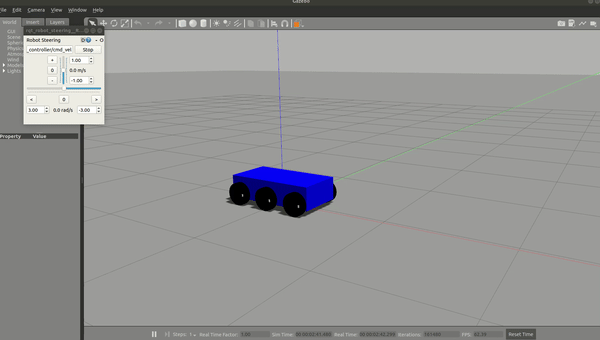

# Gazebo ROS differential Drive Plugin (Multiwheel)
This plugin solves the drawback of inbuilt differential drive plugin which supports only two wheels.
This plugin is developed to support 2N number of wheels, where N is a natural number.

**Note:** This plugin is an extension of the inbuilt differential drive plugin.

## Requirements:
Here are the requirements of the plugin.
* ROS Melodic
* Gazebo

## Features:
* Publishes the TF and Joint state messages.
* Publishes the Odom topic.

## Installation
* Clonning the plugin repository into your catkin workspace.
```bash
cd catkin_ws/src
git clone https://github.com/RamSrivatsav/gazebo_ros_diff_drive_multiwheel.git
```
* Compiling the repository
```bash
cd ../..
catkin_make
```

## Usage:
* Except for the joint parameters, this Plugin uses the same parameters as the inbuilt differential drive plugin. Here is an example of the plugin declation.
```bash
<gazebo>
    <plugin name="differential_drive_controller" filename="libgazebo_ros_diff_drive_multiwheel.so">
        <updateRate>50</updateRate>
        <leftJoints>left_back_wheel_joint left_middle_wheel_joint left_front_wheel_joint</leftJoints>
        <rightJoints>right_back_wheel_joint right_middle_wheel_joint right_front_wheel_joint</rightJoints>
        <wheelSeparation>${WheelSep}</wheelSeparation>
        <wheelDiameter>${WheelRad*2}</wheelDiameter>
        <wheelAcceleration>0.2</wheelAcceleration>
        <wheelTorque>5</wheelTorque>
        <commandTopic>diff_drive_controller/cmd_vel</commandTopic>
        <odometryTopic>odom</odometryTopic>
        <odometryFrame>odom</odometryFrame>
        <robotBaseFrame>base_link</robotBaseFrame>
        <odometrySource>1</odometrySource>
        <publishWheelTF>true</publishWheelTF>
        <publishOdomTF>true</publishOdomTF>
        <publishWheelJointState>true</publishWheelJointState>
        <legacyMode>false</legacyMode>
    </plugin>
</gazebo>
```
* There are two robot descriptions inside the urdf folder with plugin integrated into them to play with.
    * sixWheelsRobot.xacro
    * twoWheelsRobot.xacro

## Testing the plugin
* Here is the script to check if the plugin is working.
    * Setting up the plugin.
    ```bash
    cd
    mkdir -p diff_drive_ws/src
    cd diff_drive_ws/src
    git clone https://github.com/RamSrivatsav/gazebo_ros_diff_drive_multiwheel.git
    cd ../..
    catkin_make
    ```
    * Executing the test launch file.
    ```bash
    source devel/setup.bash
    roslaunch gazebo_ros_diff_drive_multiwheel test.launch
    ```
    * This above testing script is configured to use sixWheelsRobot.xacro robot description. To switch to the other robot description, open file test.launch file in launch folder, uncomment the line three, comment line two and execute the test launch file again.
* Here is a brief clip of the plugin in action.
